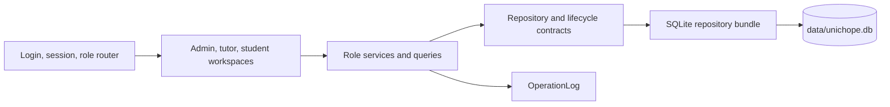

# UniChope Developer Guide

## 1. Introduction

UniChope is a Java desktop application for arranging student consultations.
Admins manage users, modules, tutor assignments, and booking statistics. Tutors
publish consultation slots, review bookings, complete consultations, and keep
notes. Students find available slots, book them, and manage their bookings.

The application stores its data in a local SQLite database. Sign-in is a **demo
account selector**, not password authentication. This guide describes the
current implementation in this repository: its architecture, workflows, role
components, storage rules, and development checks.

### 1.1 Design goals

- Keep domain rules in services and the consultation lifecycle, outside JavaFX
  controls.
- Use one repository bundle so checks and related writes share a transaction.
- Keep role views separate while sharing the user, module, slot, and booking
  model.
- Store absolute instants and present consultation dates and times in Singapore
  time (SGT).
- Make failures visible to the user without turning a successful storage write
  into a failure because diagnostic logging failed.

## 2. Technology and repository structure

### 2.1 Technology

| Purpose | Technology |
| --- | --- |
| Language and application toolchain | Java SE 25 |
| Desktop interface | JavaFX 25.0.2 (`javafx.controls`) |
| Build | Gradle 9.1 wrapper |
| Persistence | SQLite through `sqlite-jdbc` 3.50.3.0 |
| Testing | JUnit Jupiter 5.13.4; separate `test` and `uiTest` tasks |
| Diagnostics | JDK logger through `OperationLog` |

The Gradle wrapper can be launched with JDK 17 or later; compilation and the
application require the configured Java 25 toolchain. See the [README](../README.md)
for launch commands.

### 2.2 Repository structure

| Path | Responsibility |
| --- | --- |
| `src/main/java/shell` | JavaFX entry point, demo seeding, session, and role routing |
| `src/main/java/model` | Immutable users, modules, consultation slots, bookings, and notes |
| `src/main/java/data/repository` | Repository and consultation lifecycle contracts |
| `src/main/java/data/sqlite` | SQLite repositories, schema, and transaction coordinator |
| `src/main/java/admin` | Admin service, queries, statistics, and workspace |
| `src/main/java/tutor` | Tutor service, slot and booking views, and workspace |
| `src/main/java/student` | Student service, filters, calendar, timetable, and workspace |
| `src/main/java/ui` and `src/main/resources/ui` | Shared JavaFX components, artwork, and theme |
| `src/test/java` | Service, storage, domain, and desktop UI tests |
| `docs` and `logs` | Guides and interaction records |

## 3. Architecture

The shell creates one `Repositories` bundle with `SqliteRepositories.open(...)`
and passes it to the selected role view. Each workspace delegates business
operations to its role service. Services use repository interfaces; the SQLite
implementation coordinates reads and writes. `AdminQueries` builds display rows
and statistics from an `AdminSnapshot`, separate from JavaFX.



The UI uses synchronous service calls. Large data sets or slow storage may need
background execution to keep the JavaFX thread responsive.

### 3.1 Main components

| Component | Responsibility |
| --- | --- |
| Shell | Opens storage, seeds demo records, selects an active account, and routes by role |
| Role workspaces | Collect input, display results and errors, and refresh after actions |
| Role services | Revalidate actor identity and domain rules for each operation |
| Consultation lifecycle | Guard booking, cancellation, completion, and shared transactions |
| Repository bundle | Provide persistence for users, modules, assignments, slots, bookings, and notes |
| Shared UI | Apply the blue-and-white theme, common fields/actions, and login artwork |

## 4. System workflows

### 4.1 Startup and role routing

`shell.Launcher` starts `UniChopeApplication`. The application opens
`data/unichope.db` relative to the working directory and initializes SQLite
schema version 1 when needed. `DemoData.seed` creates one account per role only
when there are no users. It also adds 15 selected active requirements from the
[NUS CS AY2026/27 curriculum](https://www.comp.nus.edu.sg/cug/per-cohort/cs/cs-26-27/)
when their codes are missing, while preserving existing edits and deactivations.
It does not seed assignments, consultation slots, or bookings.

The login screen lists active accounts. `Session` selects one; `RoleRouter`
creates the matching workspace. Sign out returns to the account selector.
This flow does not authenticate a real user.

### 4.2 Publish a slot and book it

1. An admin assigns an active tutor to an active module.
2. The tutor selects that module, a date, and start/end times in SGT.
   `TutorService` checks ownership, assignment, active status, time order,
   non-past start, and overlap with the tutor's available or booked slots.
3. The student's Available slots screen shows a month calendar with counts of
   future available slots. A chosen day opens a horizontal timetable. Course
   and tutor text filters narrow the choices.
4. The student selects a block and presses **Book selected**. The lifecycle
   rechecks the slot, tutor, module, assignment, and the student's existing
   bookings inside one SQLite transaction. It writes an ACTIVE booking and
   changes the slot to BOOKED together.

Overlapping choices in the timetable occupy separate lanes. Calendar dates,
filter dates, and displayed times use SGT; persistence and comparisons use
`Instant` values. Availability is recomputed after refresh and after a booking,
so a withdrawn or already booked slot does not remain selectable.

### 4.3 Cancel and complete a consultation

A student may cancel only their own ACTIVE booking before its slot starts. In
one transaction the booking becomes CANCELLED and the slot becomes AVAILABLE.
The cancelled booking remains in the student's history, and the released slot
can be booked again.

A tutor may complete an ACTIVE booking for a slot they own. The lifecycle
changes the booking and slot to COMPLETED in one transaction. The tutor's
History & Notes tab lists completed consultations and lets the tutor load or
save a note for a selected booking. Notes are stored in the same SQLite file.

### 4.4 Admin changes and statistics

Every admin operation rechecks that the acting account is an active admin.
Deactivation retains records and history. Student deactivation is blocked by
ACTIVE bookings. Tutor or module deactivation, and assignment removal, are
blocked by affected ACTIVE bookings or future AVAILABLE slots. Module editing
preserves identity and status; assignments require active entities.

`AdminSnapshot` gathers repository data. `AdminQueries` joins bookings to
users, slots, and modules, retaining rows with missing references as
`Unavailable`. Statistics count all booking records, including cancelled and
completed records. Each rate divides by the total number of bookings, returning
0.0% when there are none.

## 5. Component design

### 5.1 Student

`StudentService.load(SlotFilter, BookingFilter)` returns available slots and
the current student's booking history. Available slots must be future,
AVAILABLE, attached to active tutor/module records and a valid assignment,
and free of an ACTIVE booking. Module filters match code or name; tutor
filters match name. Text matching trims input and ignores case. Both date
filters use the SGT calendar day of the slot start.

`StudentWorkspace` owns the Available slots and My bookings tabs.
`StudentSlotBrowser` implements the calendar-first workflow, preserving the
chosen date across course/tutor searches. `SlotTimeline` lays out time blocks
and gives overlapping choices separate rows. The selected block's details
appear beside the booking action. My bookings has independent course, tutor,
and date filters and an explicit cancellation confirmation.

### 5.2 Tutor

`TutorService` handles slot creation/cancellation, booking views and filters,
completion, and consultation notes. The Slots tab displays upcoming AVAILABLE
and BOOKED slots for a selected SGT date. The Bookings tab filters by module,
date, and status. History & Notes filters CANCELLED or COMPLETED slots by date
and displays completed bookings for note loading and saving.

`TutorSlotView` and `TutorBookingView` provide display data without putting
formatting or joins in repository records. An inactive tutor cannot create or
cancel slots, complete bookings, or save notes. Service methods retain limited
history read rules; the current workspace refreshes all tabs together and
requires active module access during that refresh.

### 5.3 Admin

`AdminService` performs guarded actions and emits operation events.
`AdminWorkspace` implements Users, Modules, Assignments, Bookings, and
Statistics tabs. It refreshes after actions and clears displayed data if the
admin's access is revoked. `AdminQueries` performs joins and aggregations,
separate from the service's authorization and validation.

### 5.4 Storage and consistency

`SqliteRepositories.open` constructs repositories sharing one
`SqliteDatabase`. The database creates its parent directory, opens short-lived
JDBC connections, and uses a shared lock and transaction connection for
`withExclusiveAccess`. A runtime failure rolls back the transaction.
SQLite has a partial unique index allowing at most one ACTIVE booking per slot.

The schema uses `PRAGMA user_version = 1`. Opening a database with another
nonzero schema version fails; there is no migration or corrupt-file recovery
flow in this version. Repository saves alone do not enforce every cross-entity
rule, so multi-record actions belong in the lifecycle or a guarded service
transaction. Tests cover the bundle's behavior; they do not establish
multi-process concurrency guarantees.

### 5.5 Time and diagnostics

Services receive a `Clock`, allowing deterministic tests. Slot and booking
times are stored as absolute instants. UI formatting and date selection use
`Asia/Singapore`.

`OperationLog.application()` uses the existing JDK logger
`unichope.operations`. Events contain a timestamp, fixed operation name,
actor/entity UUIDs, outcome, and exception type. They omit names, emails,
note contents, and exception messages. Success, failure, and delivery-failure
counters are available through `metrics()`. A logging delivery failure does
not change the outcome of a successful operation. Durable log files or a
monitoring dashboard are not configured by this repository.

### 5.6 Interface styling

`ui.AppUi` provides common headers, labelled fields, actions, and empty
states. `src/main/resources/ui/unichope.css` applies the approved blue-and-white
palette across the login and all role workspaces. `ui.Constellation` draws
login artwork with JavaFX; it needs no downloaded image asset. The app starts
at 1180 × 780 and enforces a minimum stage size of 900 × 660. Compact spacing
supports shorter windows; the calendar and timetable scroll when necessary.

## 6. Engineering and verification

### 6.1 Git and documentation

Changes are developed on branches and reviewed before merging into `main`.
Update the [User Guide](UserGuide.md) when user actions change and this guide
when architecture or persistence changes. The interaction records under
`logs/` describe work with Codex assistance and require human verification.

### 6.2 Local checks

Run from the repository root:

```powershell
.\gradlew.bat test
.\gradlew.bat uiTest
.\gradlew.bat installDist
```

On macOS/Linux use `./gradlew`. `test` excludes tests tagged `ui` and works
without a graphical desktop. `uiTest` requires a display and isolates test
classes because JavaFX cannot be restarted after `Platform.exit()`.
Tests use temporary SQLite databases, so fixture bookings do not populate
the app's `data/unichope.db`.

| Area | Automated checks |
| --- | --- |
| Domain and storage | Record validation, repository contracts, SQLite reopening and rollback |
| Student | Availability filters, booking filters, booking/cancellation, overlap and revoked access |
| Tutor | Slot rules, booking filters, completion, note ownership and history |
| Admin | Management rules, joins, statistics and access control |
| Desktop UI | Login/routing, role actions, filtering, confirmations, and refresh |

Desktop smoke tests generate screenshots under
`build/reports/design-snapshots/` for visual inspection. Student calendar and
timetable images include compact-window variants. Generated build artifacts
are ignored by Git. When software rendering is needed for reliable JavaFX
snapshots, use `-Dprism.order=sw -Dprism.dirtyopts=false` in the test JVM.

`installDist` creates `build/install/UniChope/` with launch scripts and
dependencies for the current platform. This is a development distribution;
the repository does not claim a validated cross-platform release JAR or
operating-system test matrix.

## 7. Limitations and acknowledgements

- Demo account selection provides no password authentication or account
  security. The SQLite file is local to the working directory.
- JavaFX calls the role services synchronously.
- No live NUS course feed or NUSMods integration is present. Demo courses are
  selected, fixed curriculum entries; the timetable borrows an interaction
  pattern only.
- No database schema migration, multi-process concurrency validation, or
  production release packaging is implemented here.

JavaFX, SQLite JDBC, Gradle, and JUnit are external dependencies. The student
time-grid interaction was inspered by [NUSMods](https://nusmods.com/timetable).
