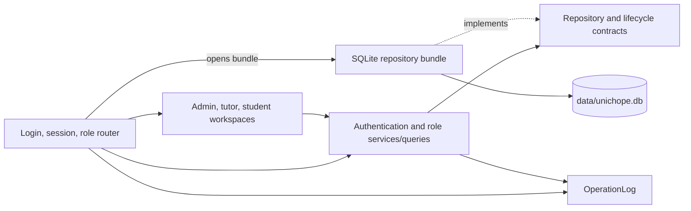
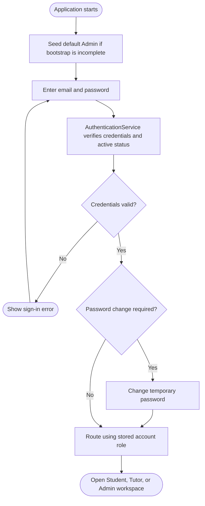
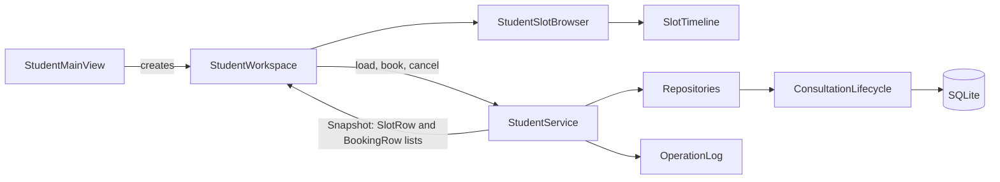
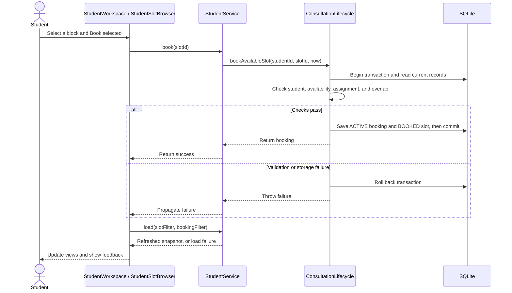
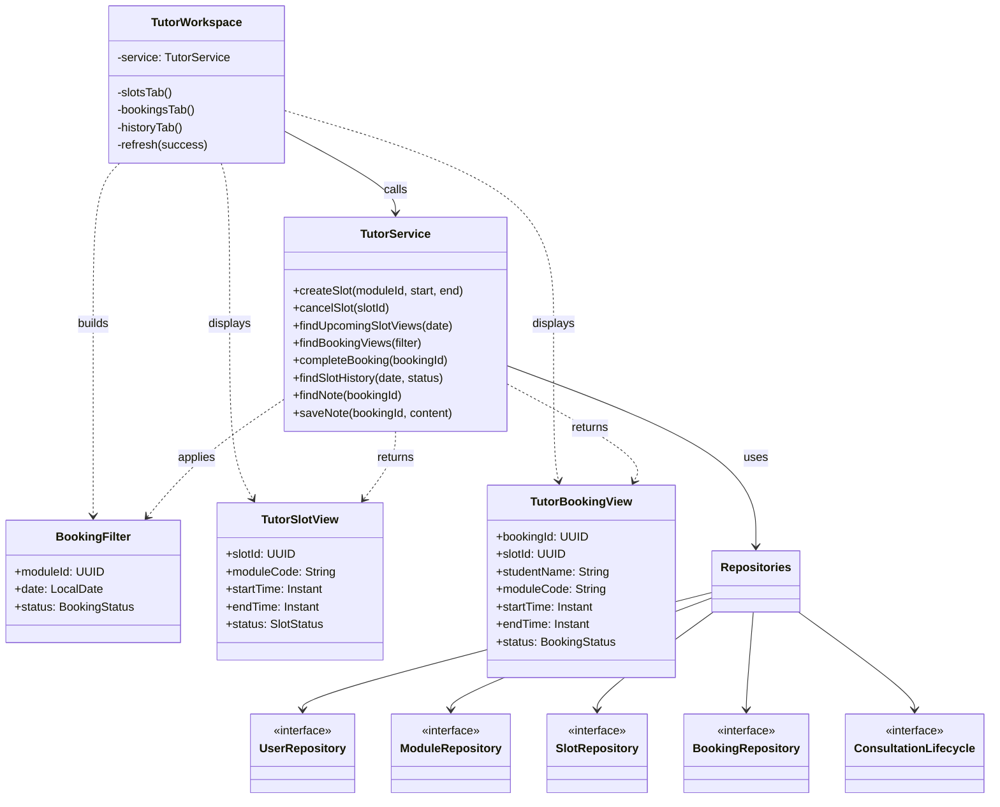
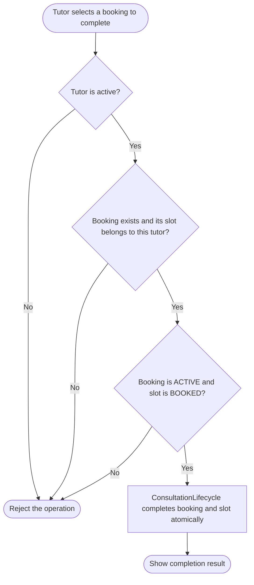
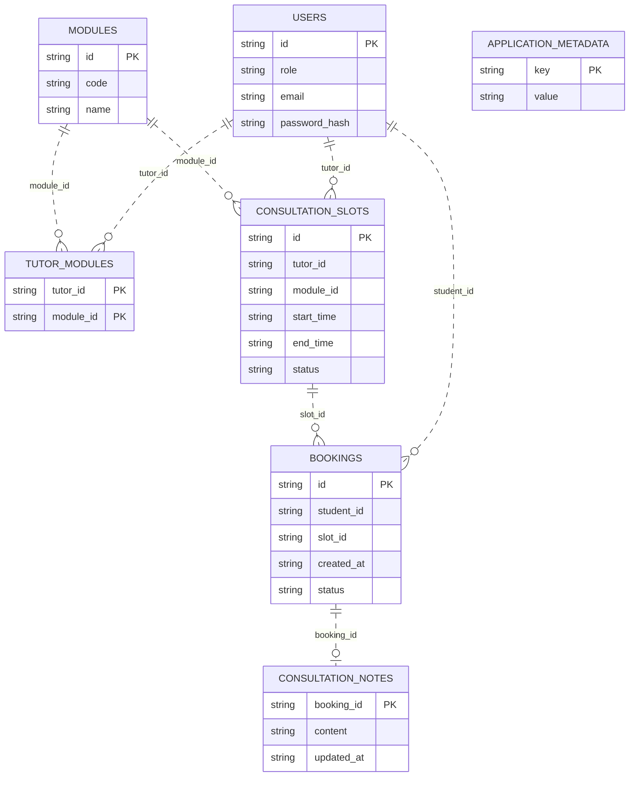

# UniChope Developer Guide

## 1. Introduction

UniChope is a Java desktop application for arranging student consultations.
Admins manage users, modules, tutor assignments, and booking statistics. Tutors
publish consultation slots, review bookings, complete consultations, and keep
notes. Students find available slots, book them, and manage their bookings.

The application stores its data in a local SQLite database. Users sign in with
an email and password; the stored account determines their role. This guide
describes the current implementation in this repository: its architecture,
workflows, role components, storage rules, and development checks.

### 1.1 Design goals

- Keep domain rules in services and the consultation lifecycle, outside JavaFX
  controls.
- Use one repository bundle so checks and related writes share a transaction.
- Keep role views separate while sharing the user, module, slot, and booking
  model.
- Store absolute instants and present consultation dates and times in Singapore
  time (SGT).
- Make failures visible to the user without turning a successful storage write
  into a failure because diagnostic logging failed.

## 2. Technology and repository structure

### 2.1 Technology

| Purpose | Technology |
| --- | --- |
| Language and application toolchain | Java SE 25 |
| Desktop interface | JavaFX 25.0.2 (`javafx.controls`) |
| Build | Gradle 9.1 wrapper |
| Persistence | SQLite through `sqlite-jdbc` 3.50.3.0 |
| Testing | JUnit Jupiter 5.13.4; separate `test` and `uiTest` tasks |
| Diagnostics | JDK logger through `OperationLog` |

The Gradle wrapper can be launched with JDK 17 or later; compilation and the
application require the configured Java 25 toolchain. See the [README](../README.md)
for launch commands.

### 2.2 Repository structure

| Path | Responsibility |
| --- | --- |
| `src/main/java/shell` | JavaFX entry point, demo seeding, session, and role routing |
| `src/main/java/model` | Immutable users, modules, consultation slots, bookings, and notes |
| `src/main/java/data/repository` | Repository and consultation lifecycle contracts |
| `src/main/java/data/sqlite` | SQLite repositories, schema, and transaction coordinator |
| `src/main/java/admin` | Admin service, queries, statistics, and workspace |
| `src/main/java/tutor` | Tutor service, slot and booking views, and workspace |
| `src/main/java/student` | Student service, filters, calendar, timetable, and workspace |
| `src/main/java/ui` and `src/main/resources/ui` | Shared JavaFX components, artwork, and theme |
| `src/test/java` | Service, storage, domain, and desktop UI tests |
| `docs` and `logs` | Guides and interaction records |

## 3. Architecture

The shell creates one `Repositories` bundle with `SqliteRepositories.open(...)`
and passes it to the selected role view. Each workspace delegates business
operations to its role service. Services use repository interfaces; the SQLite
implementation coordinates reads and writes. `AdminQueries` builds display rows
and statistics from an `AdminSnapshot`, separate from JavaFX.



The UI uses synchronous service calls. Large data sets or slow storage may need
background execution to keep the JavaFX thread responsive.

### 3.1 Main components

| Component | Responsibility |
| --- | --- |
| Shell | Opens storage, seeds missing modules, authenticates users, manages the session, and routes by stored role |
| Role workspaces | Collect input, display results and errors, and refresh after actions |
| Role services | Revalidate actor identity and domain rules for each operation |
| Consultation lifecycle | Guard booking, cancellation, completion, and shared transactions |
| Repository bundle | Provide persistence for users, modules, assignments, slots, bookings, and notes |
| Shared UI | Apply the blue-and-white theme, common fields/actions, and login artwork |

## 4. System workflows

### 4.1 Startup and role routing

`shell.Launcher` starts `UniChopeApplication`. The application opens
`data/unichope.db` relative to the working directory and initializes SQLite
schema version 2 for a new database. Existing databases with an unsupported
nonzero schema version are rejected; the application does not upgrade them.
`DemoData.seed` adds 15 selected active requirements from the
[NUS CS AY2026/27 curriculum](https://www.comp.nus.edu.sg/cug/per-cohort/cs/cs-26-27/)
when their codes are missing, while preserving existing edits and
deactivations. When authentication bootstrap is incomplete, it also creates
the default active Admin account through `AuthenticationService`, which hashes
the password with Argon2id before persistence. It does not create assignments,
consultation slots, or bookings.

After startup seeding, users sign in with email and password. The one-time
initial Admin setup remains as a fallback for a database whose bootstrap state
is incomplete and which is opened without startup seeding.
`AuthenticationService` validates the credentials and account status against
SQLite; an account flagged for a required password change must update its
password before continuing. The shell stores the authenticated identity in
`Session`, and `RoleRouter` opens the workspace for the role stored on that
account. Students can register from the sign-in screen; an Admin provisions
Tutor and additional Admin accounts. Sign out clears the session and returns
to sign in.

### 4.2 Publish a slot and book it

1. An admin assigns an active tutor to an active module.
2. The tutor selects that module, a date, and start/end times in SGT.
   `TutorService` checks ownership, assignment, active status, time order,
   non-past start, and overlap with the tutor's available or booked slots.
3. The student's Available slots screen shows a month calendar with counts of
   future available slots. A chosen day opens a horizontal timetable. Course
   and tutor text filters narrow the choices.
4. The student selects a block and presses **Book selected**. The lifecycle
   rechecks the slot, tutor, module, assignment, and the student's existing
   bookings inside one SQLite transaction. It writes an ACTIVE booking and
   changes the slot to BOOKED together.

Overlapping choices in the timetable occupy separate lanes. Calendar dates,
filter dates, and displayed times use SGT; persistence and comparisons use
`Instant` values. Availability is recomputed after refresh and after a booking,
so a withdrawn or already booked slot does not remain selectable.

### 4.3 Cancel and complete a consultation

A student may cancel only their own ACTIVE booking before its slot starts. In
one transaction the booking becomes CANCELLED and the slot becomes AVAILABLE.
The cancelled booking remains in the student's history, and the released slot
can be booked again.

A tutor may complete an ACTIVE booking for a slot they own. The lifecycle
changes the booking and slot to COMPLETED in one transaction. The tutor's
History & Notes tab lists completed consultations and lets the tutor load or
save a note for a selected booking. Notes are stored in the same SQLite file.

### 4.4 Admin changes and statistics

Every admin operation rechecks that the acting account is an active admin.
Deactivation retains records and history. Student deactivation is blocked by
ACTIVE bookings. Tutor or module deactivation, and assignment removal, are
blocked by affected ACTIVE bookings or future AVAILABLE slots. Module editing
preserves identity and status; assignments require active entities.

`AdminSnapshot` gathers repository data. `AdminQueries` joins bookings to
users, slots, and modules, retaining rows with missing references as
`Unavailable`. Statistics count all booking records, including cancelled and
completed records. Each rate divides by the total number of bookings, returning
0.0% when there are none.

## 5. Component design

### 5.1 Authentication

`AuthenticationService` owns credential validation and account lifecycle rules;
the JavaFX shell collects input and routes the returned `AuthenticatedUser`.
`AuthenticationRepository` is the credential-storage boundary, implemented
by SQLite. It alone returns `StoredCredential`; ordinary user lookups do not
expose password hashes. The user's stored role—not a role selected at sign-in—
determines which workspace `RoleRouter` opens.

On startup, demo-data initialization creates the default Admin once if
authentication bootstrap is incomplete. The account and bootstrap completion
are recorded in the same transaction. Anyone may register as a Student. An
authenticated Admin creates Tutor and additional Admin accounts with temporary
passwords; those accounts must change their password at first sign-in. Admin
password resets also require a change at the next sign-in.

Passwords must contain 8–128 characters. `AuthenticationService` hashes them
with Argon2id before storage, verifies the encoded hash at login, rejects
inactive accounts, and clears the supplied character arrays after use. Login
failures use the same email-or-password error so the UI does not reveal which
credential check failed. The database and hashing details are covered in
[Storage and consistency](#55-storage-and-consistency).



### 5.2 Student

The student implementation separates JavaFX interaction, read queries, and
atomic booking transitions. `StudentMainView.create(...)` checks that the
supplied user is an active Student, creates `StudentService` with the shared
repository bundle, student ID, UTC clock, and application logger, and supplies
the workspace with sign-out and cancellation-confirmation callbacks.

#### Components and data flow

| Component | Responsibility |
| --- | --- |
| `StudentMainView` | Compose the student service and workspace; show the cancellation confirmation dialog |
| `StudentWorkspace` | Own Available slots and My bookings tabs, invoke actions, refresh both views, and display feedback |
| `StudentSlotBrowser` | Maintain the displayed month, selected day, and course/tutor search fields |
| `SlotTimeline` | Position selectable time blocks and allocate separate lanes to overlapping options |
| `StudentService` | Build display snapshots, enforce read access, delegate mutations, and log action outcomes |
| `SlotFilter` / `BookingFilter` | Hold independent optional text and SGT-date criteria |
| `ConsultationLifecycle` | Revalidate booking/cancellation rules and update booking and slot records atomically |



`SlotRow` contains the slot ID, module code, tutor name, and start/end instants.
`BookingRow` contains the booking ID, the same display fields, and booking status.
`Snapshot` groups the available-slot and booking-history lists, so the workspace
does not join repository entities itself.

#### Queries and filtering

`StudentService.load(SlotFilter, BookingFilter)` runs within
`withExclusiveAccess(...)` and rechecks the stored account's Student role and
active status on every load. It joins users, modules, assignments, slots, and
bookings to build one snapshot. An available slot must:

- Have status `AVAILABLE` and start strictly after the injected clock's current instant.
- Belong to an active Tutor and an active module with a current tutor-module assignment.
- Have no `ACTIVE` booking referencing its ID.

Both filter records normalize null text to an empty string, strip surrounding
whitespace, and lowercase text using `Locale.ROOT`. Course searches match a
substring of the module code or name; tutor searches match a substring of the
tutor's name. A null date means any date. Date comparisons and `today()` use
`Asia/Singapore`, independently of the computer's time zone.

Available rows sort by start instant, then slot ID. Booking history includes
only the current student's records, across all statuses, sorted by start instant
then booking ID, with missing start times last. Missing module/tutor references
display as `Unavailable`; a missing slot produces null times. Such records remain
visible with empty filters, but cannot match criteria requiring missing fields.
The booking-history filters are independent of the available-slot filters.

#### Calendar and timetable

`StudentSlotBrowser` opens at the current SGT month. It groups available rows by
their start date to show daily counts, disables past dates, and prevents backward
navigation beyond the current month. Selecting a date refreshes the snapshot and
opens that day's timetable. The browser sends a null date in its `SlotFilter`;
it applies the selected day locally, retaining the wider set of rows for calendar
counts. The service also supports explicit date filtering for other callers.

Course/tutor search and Clear retain the selected day. Returning to Calendar
clears those text filters and displays the selected day's month. Each render
recreates the timetable and clears the selected slot, so **Book selected** stays
disabled until a block is selected again. Selecting a block displays its course,
tutor, and SGT times and binds the booking action to its slot ID.

`SlotTimeline.lanes(...)` uses greedy interval partitioning: sort by module,
tutor, start, and ID, then reuse the first lane with the same module and tutor
whose last slot ends at or before the next slot starts. Otherwise, create a new
lane. Adjacent slots can share a lane; overlapping slots remain independently
selectable. The horizontal scale covers at least 08:00–18:00, expands for earlier
or later slots, and labels times after midnight with a day offset. Module codes
map deterministically to five colour classes; tooltips and accessible text also
identify each block.

These lanes organize available choices, not the student's personal schedule.
Availability queries do not hide slots that overlap the student's existing
bookings; the lifecycle rejects such conflicts when booking is attempted.

#### Booking and cancellation

`StudentService.book(slotId)` delegates to
`bookAvailableSlot(studentId, slotId, now)`. Inside one SQLite transaction, the
lifecycle rechecks the active Student, the availability conditions above, and
overlap with the student's `ACTIVE` bookings. Two intervals overlap when
`newStart < existingEnd && existingStart < newEnd`, so back-to-back consultations
are allowed. A successful operation creates an `ACTIVE` booking and changes the
slot to `BOOKED`; a failed operation rolls back its writes.



For cancellation, `StudentWorkspace` first requires a selected `ACTIVE` booking
and asks for confirmation. Dismissing the dialog performs no mutation.
`StudentService.cancel(bookingId)` delegates to `cancelActiveBooking(...)`, which
rechecks that the actor is an active Student, owns the booking, and has an
`ACTIVE` booking paired with a `BOOKED` slot that starts strictly in the future.
The transaction changes the booking to `CANCELLED` and the slot to `AVAILABLE`.
The old booking remains in history; rebooking creates a new booking record.

Both service actions record success or failure through `OperationLog`, using
`student.booking.create` with the slot ID and `student.booking.cancel` with the
booking ID. The lifecycle is the final validation boundary even if the UI shows
stale availability or the account has been deactivated since sign-in.

#### Refresh, errors, and verification

The workspace refreshes both tabs after successful and failed mutations. On
success it displays `Done` if reloading also succeeds; after an action failure
it attempts a refresh before displaying the original error. Validation and
access errors display their messages; other runtime failures display a generic
storage error. A failed load clears available slots, and a `SecurityException`
also clears booking history. Other load failures leave the previous history
visible. Calls are synchronous on the JavaFX thread.

Existing tests cover these boundaries:

| Test class | Coverage |
| --- | --- |
| `StudentServiceTest` | Booking/cancellation state changes and history, independent filters and SGT dates, overlap, ownership, inactive accounts/entities, missing assignment, cancellation after start, and competing bookings for one slot |
| `SlotTimelineTest` | Separate lanes for overlapping choices and different course/tutor pairs; shared lanes for adjacent slots |
| `StudentUiTest` | Calendar selection, timetable filtering, booking, cancellation confirmation, refresh, and desktop snapshots |

The service and lane tests run with `test`; the desktop test runs with `uiTest`.

### 5.3 Tutor

`TutorWorkspace` owns the Slots, Bookings, and History & Notes tabs. It parses
the tutor's date/time input, constructs filters, displays service results, and
shows operation feedback. It does not access repositories directly.
`TutorService` is the Tutor application boundary: it validates the acting
tutor, applies slot and booking rules, builds table display records, and
delegates multi-record state changes to `ConsultationLifecycle`. Each service
operation runs through the shared exclusive-access boundary and records its
outcome through `OperationLog`.



The workspace refreshes its tables from service results. `TutorSlotView` and
`TutorBookingView` contain only the fields needed by those tables, so the UI
does not perform joins or format repository entities itself. `BookingFilter`
keeps the optional module, SGT date, and booking status criteria together.

#### Slot operations

Creating a slot requires an active tutor, an active module assigned to that
tutor, a start time that is not in the past, an end time after the start, and
no overlap with another AVAILABLE or BOOKED slot owned by the tutor. The new
slot starts as `AVAILABLE`. The Slots tab shows upcoming AVAILABLE and BOOKED
slots, either for a chosen SGT date or across all upcoming dates.

A tutor may cancel only their own AVAILABLE slot. A BOOKED slot cannot be
cancelled or rescheduled directly: its student must first cancel the future
ACTIVE booking, which releases the slot. The tutor can then cancel the
released slot and create a replacement.

#### Bookings, history, and notes

The Bookings tab filters by module, SGT date, and status. `TutorBookingView`
combines booking data with the slot, module, and student fields used in the
table. Completing a booking requires an active tutor who owns the slot and a
consistent `ACTIVE` booking plus `BOOKED` slot. `ConsultationLifecycle`
atomically changes both records to `COMPLETED`. Completion is not time-gated,
so it can currently be recorded before the scheduled start time.

The completion activity below shows the checks that must pass before the
two-record transition is performed:



History & Notes filters slot history by an optional date and one status at a time:
`CANCELLED` or `COMPLETED`. Its separate completed-bookings table supports
loading and saving a note for an owned completed consultation. A note is
stored against its booking; saving again replaces its content.

Mutations require an active tutor. At the service boundary, inactive tutors
may read completed booking and slot history and notes, but not active records
or cancelled history. The current workspace refreshes all tabs together and
loads active assigned modules as part of that refresh, so losing active-tutor
access can cause the combined refresh to clear the displayed data.

### 5.4 Admin

`AdminService` performs guarded actions and emits operation events.
`AdminWorkspace` implements Users, Modules, Assignments, Bookings, and
Statistics tabs. It refreshes after actions and clears displayed data if the
admin's access is revoked. `AdminQueries` performs joins and aggregations,
separate from the service's authorization and validation.

The Users form delegates account creation to `AuthenticationService.provisionAccount`
for all three roles so the account and hashed credential are stored together, with
a required password change. Student self-registration remains available. The
legacy `AdminService.addUser` creates identity records only; it is not the UI's
account-provisioning path. Deactivation and reactivation preserve credentials,
assignments and historical records.

Kok Seng's regression coverage is in `src/test/java/admin`, with shared logger
checks in `src/test/java/util`. `AdminServiceTest` checks authorization, guarded
deactivation/unassignment, validation and failure handling; `AdminQueriesTest`
checks all-status totals, empty data and retained history. `AdminUiTest` exercises
the five tabs, including student provisioning and revoked access. Provisioning
regressions also live in `AuthenticationServiceTest`, beside the shared flow.
The 29 September local verification passed 152 non-UI tests, 8 desktop tests
and `installDist` on Windows. These are whole-project totals, not counts of
tests authored by Kok Seng; they do not establish cross-platform validation.

### 5.5 Storage and consistency

The running application uses SQLite for accounts, modules, tutor assignments,
consultation slots, bookings, and notes. `data.repository` defines the storage
contracts and the `Repositories` bundle; `data.sqlite` implements those
contracts. The shell composes one bundle with `SqliteRepositories.open(...)`
and injects it into the role services. Services depend on the contracts, not
on JDBC or SQLite classes.

By default, the application opens `data/unichope.db` relative to its working
directory. `SqliteDatabase` creates the parent directory if needed. Each
repository in the bundle shares that database coordinator, so their operations
can participate in the same transaction. The main tables are:

| Table | Stored information |
| --- | --- |
| `users` | Student, Tutor, and Admin identity, role, active state, encoded password hash, and required-password-change flag |
| `modules` | Module code, name, and active state |
| `tutor_modules` | Tutor-to-module assignments, with one row per pair |
| `consultation_slots` | Tutor, module, start/end instants, and slot status |
| `bookings` | Student, slot, creation instant, and booking status |
| `consultation_notes` | Note content and update instant, keyed by booking |
| `application_metadata` | Initial Admin bootstrap state |

The diagram shows the logical ID references between tables. `users` holds all
three roles; the `role` value distinguishes Tutors for slots and Students for
bookings. The metadata table is independent of the consultation records.



The dotted associations above are conceptual references only: the SQLite
schema declares no SQL `FOREIGN KEY` constraints. Application services and the
consultation lifecycle validate related records where required.

Slot and booking instants are stored as ISO-8601 text and parsed back to
`Instant`; presentation uses Singapore time in the UI. Authentication hashes
are stored in the `users` row and are only exposed through the separate
`AuthenticationRepository` boundary. Passwords are hashed with Argon2id before
storage; ordinary user queries do not return the hash.

`SqliteDatabase` opens short-lived JDBC connections for standalone operations.
It enables SQLite foreign-key processing on each connection, applies a
5-second busy timeout, and serializes operations through a lock shared by the
repository bundle. A transaction uses one connection for nested repository
calls. If a runtime exception escapes the transaction, the coordinator rolls
back before propagating the failure. `withExclusiveAccess` uses this transaction
boundary for service-level read/check/write operations.

Cross-entity business rules are enforced by services and the consultation
lifecycle, rather than by declared SQL foreign-key constraints. For example,
the database schema does not declare `FOREIGN KEY` relationships. The schema
does enforce one important booking invariant with a partial unique index:
there can be at most one `ACTIVE` booking per slot. The lifecycle also performs
booking and slot transitions together:

- Booking a future available slot inserts the `ACTIVE` booking and changes the
  slot to `BOOKED` in one transaction.
- Student cancellation changes the booking to `CANCELLED` and releases the
  slot to `AVAILABLE` in one transaction.
- Tutor completion requires an `ACTIVE` booking paired with a `BOOKED` slot,
  then changes both to `COMPLETED` in one transaction.
- Account creation stores the user and credential together. Initial Admin
  creation also marks bootstrap complete in the same transaction.

Repository `save` operations insert or replace records by ID; reads return
immutable values and list snapshots. The common repository contract has no
hard-delete operation for historical entities. These repository writes alone
do not enforce every business invariant, so related state changes must use the
lifecycle or a guarded service transaction.

The schema version is tracked with `PRAGMA user_version`; version 2 is current.
A new database (version 0) receives the current schema. Opening an existing
database with another nonzero version fails rather than guessing how to change
its data. There is no automatic schema upgrade or corrupt-file recovery flow.
Tests exercise the repository bundle and transaction behavior using temporary
databases, but do not establish multi-process concurrency guarantees.

### 5.6 Time and diagnostics

Services receive a `Clock`, allowing deterministic tests. Slot and booking
times are stored as absolute instants. UI formatting and date selection use
`Asia/Singapore`.

`OperationLog.application()` uses the existing JDK logger
`unichope.operations`. Events contain a timestamp, fixed operation name,
actor/entity UUIDs, outcome, and exception type. They omit names, emails,
note contents, and exception messages. Success, failure, and delivery-failure
counters are available through `metrics()`. A logging delivery failure does
not change the outcome of a successful operation. Durable log files or a
monitoring dashboard are not configured by this repository.

These counters are process-local diagnostics, separate from the all-time booking
statistics stored in SQLite. All three role views use the same application logger.
`RoleOperationLogTest` exercises admin, tutor and student actions against one
SQLite bundle and checks shared success/failure counts and event privacy.

### 5.7 Interface styling

`ui.AppUi` provides common headers, labelled fields, actions, and empty
states. `src/main/resources/ui/unichope.css` applies the approved blue-and-white
palette across the login and all role workspaces. `ui.Constellation` draws
login artwork with JavaFX; it needs no downloaded image asset. The app starts
at 1180 × 780 and enforces a minimum stage size of 900 × 660. Compact spacing
supports shorter windows; the calendar and timetable scroll when necessary.

## 6. Engineering and verification

### 6.1 Git and documentation

Changes are developed on branches and reviewed before merging into `main`.
Update the [User Guide](UserGuide.md) when user actions change and this guide
when architecture or persistence changes. The interaction records under
`logs/` describe work with Codex assistance and require human verification.

### 6.2 Local checks

Run from the repository root:

```powershell
.\gradlew.bat test
.\gradlew.bat uiTest
.\gradlew.bat installDist
```

On macOS/Linux use `./gradlew`. `test` excludes tests tagged `ui` and works
without a graphical desktop. `uiTest` requires a display and isolates test
classes because JavaFX cannot be restarted after `Platform.exit()`.
Tests use temporary SQLite databases, so fixture bookings do not populate
the app's `data/unichope.db`.

| Area | Automated checks |
| --- | --- |
| Domain and storage | Record validation, repository contracts, SQLite reopening and rollback |
| Student | Availability filters, booking filters, booking/cancellation, overlap and revoked access |
| Tutor | Slot rules, booking filters, completion, note ownership and history |
| Admin | Management rules, joins, statistics and access control |
| Desktop UI | Login/routing, role actions, filtering, confirmations, and refresh |

Desktop smoke tests generate screenshots under
`build/reports/design-snapshots/` for visual inspection. Student calendar and
timetable images include compact-window variants. Generated build artifacts
are ignored by Git. When software rendering is needed for reliable JavaFX
snapshots, use `-Dprism.order=sw -Dprism.dirtyopts=false` in the test JVM.

`installDist` creates `build/install/UniChope/` with launch scripts and
dependencies for the current platform. This is a development distribution;
the repository does not claim a validated cross-platform release JAR or
operating-system test matrix.

## 7. Limitations and acknowledgements

- There is no email verification or self-service password recovery; an Admin
  must reset a password and provide the temporary password to its user.
- The SQLite file is local to the working directory, so launching from another
  directory can open a different database file.
- JavaFX calls the role services synchronously.
- No live NUS course feed or NUSMods integration is present. Demo courses are
  selected, fixed curriculum entries; the timetable borrows an interaction
  pattern only.
- Database schema upgrades are not supported; files with unsupported nonzero
  schema versions are rejected. Multi-process concurrency and production
  release packaging are not validated here.

JavaFX, SQLite JDBC, Gradle, and JUnit are external dependencies. The student
time-grid interaction was inspered by [NUSMods](https://nusmods.com/timetable).
