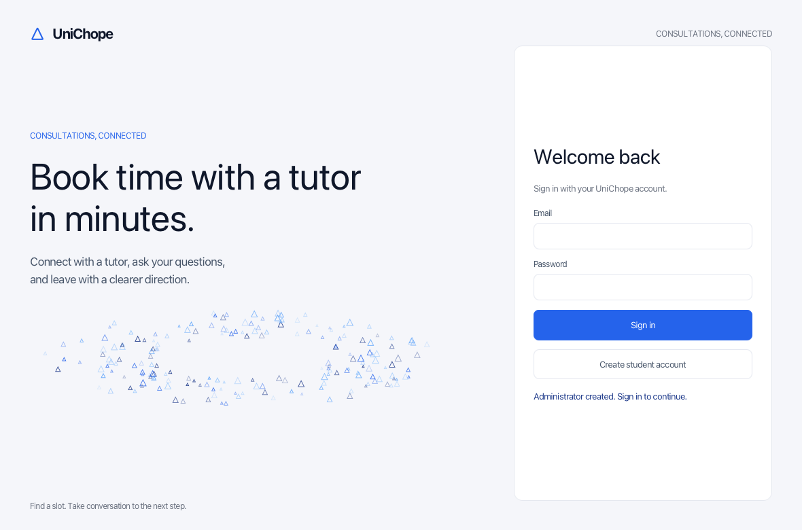
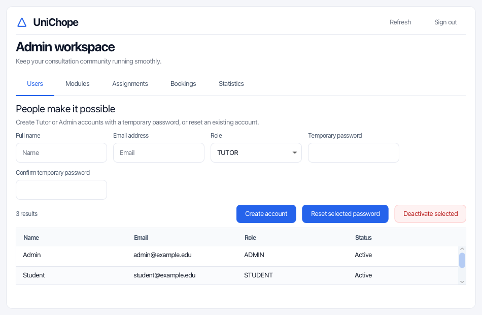
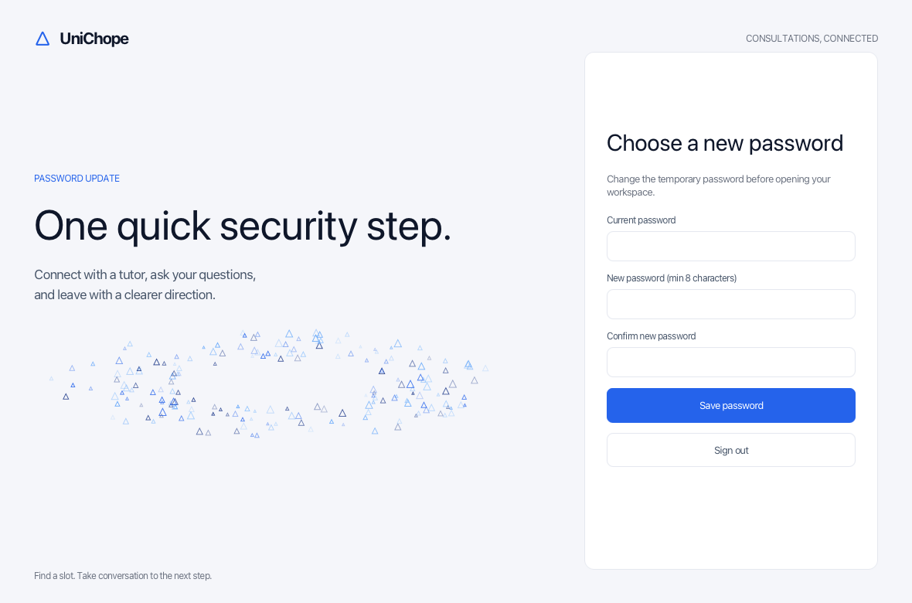
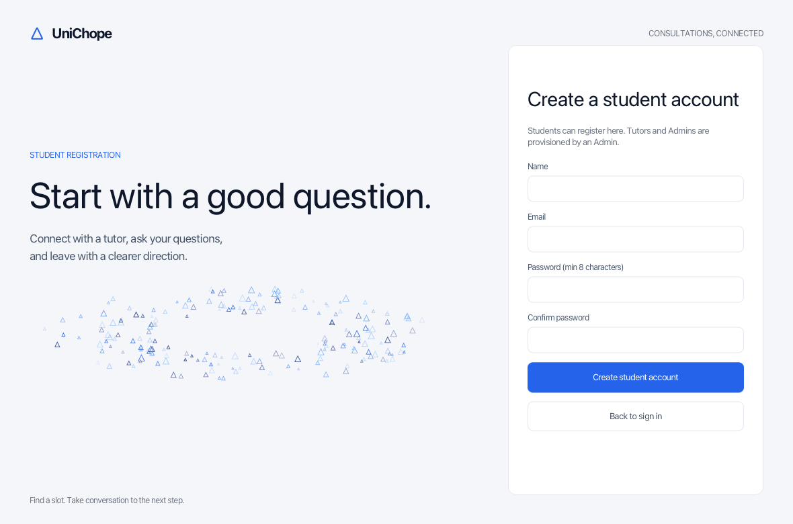
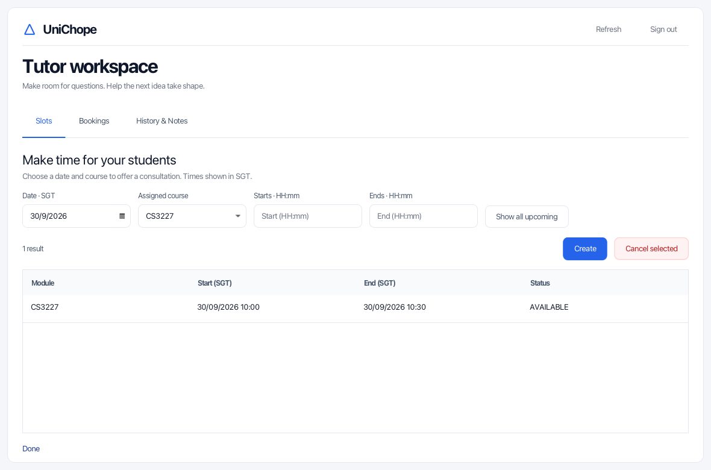
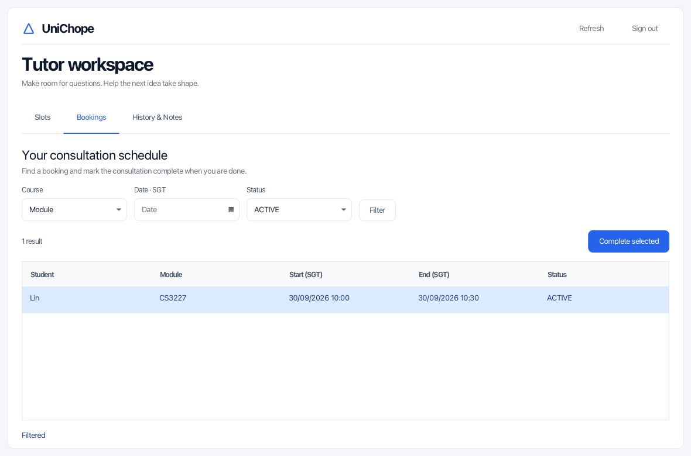
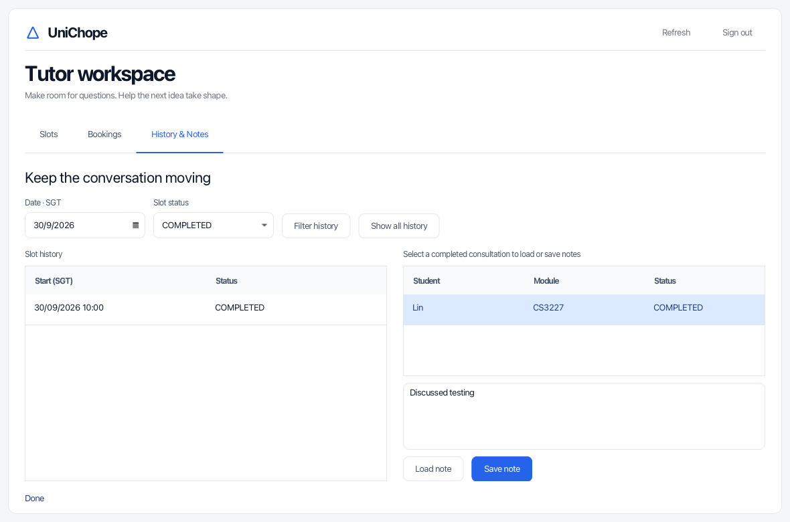

# UniChope User Guide

UniChope is a desktop app for booking student consultations. Admins manage
modules, tutors, and users; tutors offer consultation times; students choose
an available time and track their bookings. Dates and times shown in the app
use Singapore time (SGT).

## 1. Quick start

### 1.1 Requirements and launch

The application requires Java 25 and a graphical desktop. Its minimum window
size is 900 × 660. From the repository root, run:

```powershell
.\gradlew.bat run
```

On macOS or Linux, use `./gradlew run`. The first Gradle run may need internet
access to obtain the Java toolchain and dependencies. See the
[README](../README.md) for build and testing commands.

UniChope stores data in `data/unichope.db` relative to the directory from
which it runs. Bookings and edits remain after closing and reopening the app.

---
### 1.2 Create an account and sign in

UniChope stores account details and password hashes locally. The role is
attached to the account, so the sign-in screen does not ask you to choose
Student, Tutor, or Admin. Use **Sign out** in a workspace to return to sign in.

#### Default Admin sign-in

A fresh database includes an active Admin account. Sign in with:

- Email: `admin@u.nus.edu`
- Password: `12345678`



#### Additional Admin accounts

After initial setup, an existing Admin can create another Admin account from
the **Users** tab. The Admin enters the new user's name and email, chooses
`ADMIN`, and sets a temporary password and confirmation. Give that temporary
password to the new Admin. At first sign-in, they must change it before the
Admin workspace opens. If another active Admin is available, they can reset a
forgotten password from **Users**; the replacement temporary password must
also be changed at sign-in.



#### Tutor account and first sign-in

Tutors cannot self-register. Ask an Admin to create your Tutor account and
provide its temporary password. If you need a password reset later, ask an
Admin to reset it from **Users**. Sign in with your email and the temporary
password; UniChope asks you to choose a new password before opening the Tutor
workspace.



#### Student account

Students can register themselves. On the sign-in screen, select **Create
student account**. Enter your name, email, and password twice, then press
**Create student account**. UniChope signs you in and opens the Student
workspace.



#### Returning sign-in

Enter your email and password, then press **Sign in**. UniChope opens the
workspace for the role stored on your account. This sign-in form is shared by
Students, Tutors, and Admins.

A fresh database also receives 15 active modules selected from the
[NUS CS AY2026/27 curriculum](https://www.comp.nus.edu.sg/cug/per-cohort/cs/cs-26-27/).
It starts without Tutor assignments, consultation slots, or bookings. Restarting
the application does not recreate or overwrite an existing Admin account.
Existing module edits and deactivations are preserved when the app restarts.

## 2. Interface tour

| Workspace | Main tabs | What you can do |
| --- | --- | --- |
| Admin | Users, Modules, Assignments, Bookings, Statistics | Manage the consultation setup and review activity |
| Tutor | Slots, Bookings, History & Notes | Offer time slots, complete bookings, and maintain notes |
| Student | Available slots, My bookings | Find and book a slot, or review and cancel a booking |

**Refresh** reloads stored data. Action messages appear in the workspace and
explain validation errors. Long table values can be inspected by hovering
over their cells in the admin workspace.

## 3. First consultation walkthrough

These steps exercise the main workflow with accounts created in the app.

1. On first launch, sign in with the default Admin account described above.
2. In the Admin workspace, open **Users**. Create a Tutor account with a
   temporary password. Open **Assignments**, choose that Tutor and an active
   module such as `CS1101S`, then press **Assign**.
3. Sign out. The Tutor signs in with the temporary password and sets a new
   password when prompted. In **Slots**, choose a future date and the
   assigned module, enter `10:00` and `10:30`, then press **Create**.
4. Sign out. On the sign-in screen, select **Create student account** and
   register a Student account. The Student enters **Available slots**, picks
   the slot's date, selects its timetable block, and presses **Book selected**.
5. In **My bookings**, confirm the booking is `ACTIVE`. Sign out and sign in
   as the Tutor. In **Bookings**, select the booking and press **Complete
   selected** after the consultation.
6. In **History & Notes**, select the completed consultation, enter a note,
   and press **Save note**. Sign out and return to the Admin account to review
   the records in **Bookings** or **Statistics**.

Times entered by the tutor and all dates shown to students are interpreted in
SGT. Choose a date and start time that have not already passed.

## 4. Student workspace

### 4.1 Find and book a slot

The **Available slots** tab opens a large month calendar. Days show how many
available consultations they contain. Use the month arrows or **This month**
to navigate. Past dates are disabled. Select a date to open its timetable;
you can also choose a future day with zero slots to see the empty state.

The timetable places time across the top and courses and tutors down the
side. Each coloured block represents one available slot. Scroll horizontally
for later hours and vertically when many tutors or courses are present.
Overlapping choices appear separately so each can be selected.

Use the **Course** and **Tutor** fields to search within the selected day.
Course search accepts part of a code or name; tutor search accepts part of a
name. Matching ignores case and extra surrounding spaces. Press **Search**
or Enter to apply the text filters. **Clear** removes the text filters while
keeping the chosen date. The day arrows change the date, and **Calendar**
returns to the month view.

Select a block to display its course, tutor, and exact time. **Book selected**
becomes available after selection. The app checks availability again when
you book, so a slot taken or withdrawn since the last refresh may be rejected.
You also cannot hold two ACTIVE bookings that overlap in time.

**Refresh** reloads availability and clears the selected block while keeping
the chosen date and any course/tutor search. Calendar counts and day results
use the SGT date on which a slot starts.

### 4.2 Review, filter, and cancel bookings

**My bookings** shows ACTIVE, CANCELLED, and COMPLETED bookings. Search by
part of a course code/name, tutor name, or SGT date; combine fields to narrow
the list. These filters are independent of Available slots. **Clear** resets
all three booking filters, and **Refresh** keeps the current filter values.

To cancel, select an ACTIVE booking and press **Cancel selected**, then
confirm. Cancellation is allowed only before the slot starts. The booking
remains in your history as CANCELLED and the slot becomes available again.

## 5. Tutor workspace

The tutor workspace has three tabs: **Slots**, **Bookings**, and **History &
Notes**. Dates and times use Singapore time (SGT); table times appear as
`dd/MM/yyyy HH:mm`. Press **Refresh** to reload the tables.

### 5.1 Offer and manage slots

The table starts by showing all your upcoming AVAILABLE and BOOKED slots.
Choose **Date · SGT** to see one day, or press **Show all upcoming** to clear
the date filter. To create a slot, choose a future date and an active assigned
module, then enter a start and end time in 24-hour `HH:mm` format. The end
must be later than the start, and the slot cannot overlap another AVAILABLE
or BOOKED slot you own.

**Create example:** Choose **30/09/2026** and **CS3227**, enter `10:00` and
`10:30`, then press **Create**. The new row appears as `AVAILABLE`.

**Cancel example:** Select an AVAILABLE row and press **Cancel selected**. If
the slot is BOOKED, its student must cancel the booking first. The released
slot then becomes AVAILABLE and can be cancelled by the tutor.



*Example: CS3227 is available on 30/09/2026 from 10:00 to 10:30.*

### 5.2 Review bookings and complete consultations

The table shows your bookings with student, course, date/time, and status.
Use **Course**, **Date · SGT**, and **Status**, then press **Filter**.

**Filter example:** To find an active CS3227 booking on 30 September, choose
**CS3227**, **30/09/2026**, and `ACTIVE`, then press **Filter**.

**Complete example:** Select that ACTIVE booking and press **Complete
selected**. Both the booking and slot become `COMPLETED`. You may mark it
complete before its scheduled end if the consultation finishes early.



*Example: select the ACTIVE booking, then press **Complete selected**.*

### 5.3 Review slot history and manage notes

This tab has **Slot history** and a separate table of completed consultations.
Slot history shows one status at a time: `CANCELLED` or `COMPLETED`.

**Filter history example:** To see completed slots on 30 September, choose
**30/09/2026** and `COMPLETED`, then press **Filter history**. Choose
`CANCELLED` instead to see cancelled slots for that date.

**Show all history example:** Choose `CANCELLED` and press **Show all
history** to see cancelled slots from every date. The status stays selected;
cancelled and completed slots are never combined. This filter does not change
the separate completed consultations table, which lists all your completed
bookings.

**Save note example:** Select a completed consultation and press **Load note**.
If no note exists, the text box is blank. Enter `Reviewed recursion; practise
tracing tree traversal.` and press **Save note**. The note is saved to that
booking; saving again replaces its previous note. Notes remain available
after you close and reopen the app.



*Example: load, edit, and save a note for the selected completed consultation.*

## 6. Admin workspace

The admin workspace has five tabs. Admin actions require an active admin
account. Tables retain inactive records and booking history when relevant.

### 6.1 Users

Enter a name and email, choose TUTOR or ADMIN, provide a temporary password
and confirmation, then press **Create account**. Give the temporary password
to the account holder; they must change it at first sign-in. Students create
their own accounts from the sign-in screen. Names must not be blank. Email
addresses must be valid and unique without regard to case, including among
inactive accounts.


Select a user and press **Deactivate selected**, then confirm. Deactivation
retains the record and its history; it does not permanently delete the user.
A student with an ACTIVE booking cannot be deactivated. A tutor with an
ACTIVE booking or future AVAILABLE slot cannot be deactivated. Overdue
ACTIVE bookings still block the action.

To restore a deactivated Student or Tutor account, select its inactive row,
press **Reactivate selected**, and confirm. Reactivation keeps the same account,
password, assignments, and history. The user can sign in again with their
existing credentials. Admin accounts cannot be changed with these buttons.

### 6.2 Modules

Enter a code and name, then press **Create**. Codes are unique without
regard to case. Select a module to populate the form, edit its code or name,
and press **Save selected**. Its identity and active status are preserved.

**Deactivate selected** requires confirmation. ACTIVE bookings or future
AVAILABLE slots for that module block deactivation. Assignments remain in
history, but inactive modules cannot receive new assignments.

The fresh database seeds these modules:

| Computing and communication | Mathematics and statistics |
| --- | --- |
| CS1101S, CS1231S, CS2030S, CS2040S | MA1521, MA1522 |
| CS2100, CS2101, CS2103T, CS2106 | ST2334 |
| CS2109S, CS3230, ES2660, IS1108 |  |

These are selected curriculum requirements, not a live catalogue of all
NUS courses.

### 6.3 Assignments

Choose an active tutor and active module, then press **Assign**. Repeating
the same pair does not create a duplicate. Select an assignment and press
**Unassign selected** to remove it after confirmation. An affected ACTIVE
booking or future AVAILABLE slot blocks unassignment; other tutor-module
pairs do not block it.

### 6.4 Bookings and statistics

**Bookings** is a read-only table of all booking statuses, students, tutors,
modules, and SGT start/end times. Default ordering is chronological; click
column headers to change table sorting. Inactive entities remain visible.
Missing references appear as `Unavailable`.

**Statistics** covers all booking records, including inactive entities and
all statuses. It lists booking counts by module and tutor. The completion
rate is completed bookings divided by all bookings; the cancellation rate
is cancelled bookings divided by all bookings. With no bookings, both rates
show `0.0%`. A cancelled booking followed by a new booking counts as two
records.

## 7. Saving and troubleshooting

Successful changes are stored in `data/unichope.db` as they happen. There is
no separate Save button for the whole application. Closing the window does
not discard completed writes. The database is tied to the working directory;
starting the app from another folder may open a different `data/unichope.db`.

### No consultation slots appear

1. Check that an admin assigned the tutor to an active module.
2. Ask the tutor to create a future AVAILABLE slot.
3. Check the selected SGT date and clear course/tutor filters.
4. Press **Refresh**. Booked, cancelled, past, or withdrawn slots do not
   appear as available.

### A booking or management action is rejected

Read the message in the workspace. A booking may have been taken, withdrawn,
or overlapped with another ACTIVE booking; refresh and choose another time.
Admin changes can be blocked by ACTIVE bookings or future AVAILABLE slots.
Only a future ACTIVE booking can be cancelled by its student.

### The app does not start or prior data is missing

Check `java -version` and confirm the configured Java 25 toolchain is
available. Run the Gradle command from the repository root. Check the
working directory if a previous database appears to be missing. An
unsupported SQLite schema version prevents the app from opening that file;
this version has no automatic schema migration.

## 8. Current limitations

- Rescheduling is not available as a single action. For a future booking, the
  student must cancel it before the slot starts; the tutor can then cancel the
  released slot and create a replacement for the student to book.
- There is no email verification or self-service password recovery. An Admin
  must reset a password and provide the temporary password to the user; the
  user must change it at the next sign-in.
- All data is local. There is no shared server, live NUS course feed, or
  NUSMods account integration.
- The seeded modules are a selected list; assignments and slots must be
  created in the app before a student can make a booking.
- `installDist` builds a development distribution for the current platform;
  a cross-platform release JAR has not been validated here.

## 9. Frequently asked questions

### Where is my data stored? Will it remain after I close the app?

Data is saved in `data/unichope.db` relative to the app's working directory.
Changes are stored as you make them. If you launch the app from a different
directory, it may open a different database file.

### Why can’t I see any modules or slots as a tutor?

Tutors see only active modules assigned to them. An Admin must create the
Tutor account and assign at least one active module. The app seeds 15 modules
in a fresh database, but does not create tutor assignments or consultation
slots. Ask an assigned tutor to create a future slot, then refresh.

### How do I get a Tutor account?

Tutors cannot self-register. An Admin creates the account and gives the Tutor
a temporary password. The Tutor chooses a new password at first sign-in.

### What if I forget my password?

Ask an Admin to reset it. The Admin gives you a temporary password, which you
must change at your next sign-in. There is no self-service password recovery.

### Where can I find cancelled or completed slots?

Tutors can open **History & Notes** and choose either `CANCELLED` or
`COMPLETED` for Slot history. Those statuses are shown separately, not
together. See [Review slot history and manage notes](#53-review-slot-history-and-manage-notes).

### Can a booked consultation be rescheduled?

Not in one action. The Student must cancel the future booking before it starts.
The Tutor can then cancel the released slot and create a replacement for the
Student to book.
